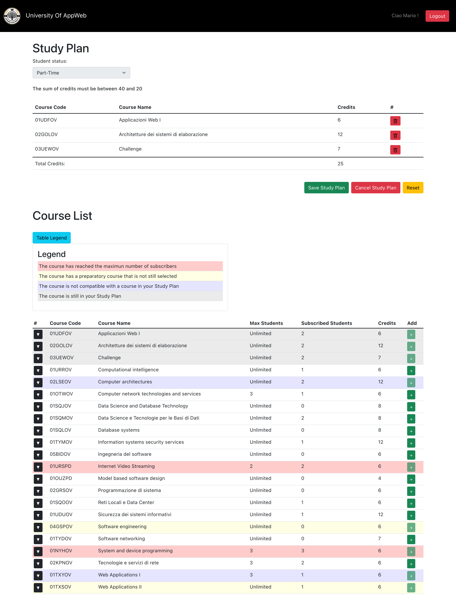

# Exam #1: Piano degli studi
## Student: s302373 CARLUCCIO ALEX

## React Client Application Routes

- Route `/`: Home page. Used to see only the courses if not authenticated, or, if authenticated, to create/modify and delete a personal Study Plan
- Route `/login`: Login page. Used for login and access in a personal logged-in page

## API Server

- POST `/api/sessions`
  - description: Authenticate the user who is trying to login
  - request body content: Credentials of the user who is trying to login
  - response: `200 OK` (success) if all is ok
  - response body content: Object (User info) like this:
      ```
      {
       id: 1, 
       username: 'mario.rossi@studenti.polito.it', 
       name: 'Mario', 
       type: 1
      }
      ```

- DELETE `/api/sessions/current`
  - description: Logout current user
  - request body content: _None_
  - response: `200 OK` (success) if all is ok
  - response body content: _None_

- GET `/api/sessions/current`
  - description: Get user info of the current session
  - request body content: _None_ (Just the _userID_)
  - response: `200 OK` (success) if all is ok
  - response body content: Object (User info) like this:
      ```
      {
       id: 1, 
       username: 'mario.rossi@studenti.polito.it', 
       name: 'Mario', 
       type: 1
      }
      ```
    
- GET `/api/courses`
  - description: Get all the courses offered by University
  - request body content: _None_
  - response: `200 OK` (success) if all is ok
  - response body content: Array of Objects (Courses) where a single element is like this: 
    ```
    {
     coursecode: '03LIMOK', 
     name: 'Applicazioni Web III', 
     credits: 6,
     maxstudents: 1000, 
     subscribers: 32, 
     preparatory: "02KSFHQ",
     incompatibilies: "03TYKGR",
    }
    ```
- GET `/api/studyplan`
  - description: Get the user StudyPlan
  - request body content: `UserId`
  - response: `200 OK` (success) if all is ok
  - response body content: Array of Objects (Courses) where a single element is like this: 
    ```
    {
     coursecode: '03LIMOK', 
     name: 'Applicazioni Web III', 
     credits: 6,
    }
    ```
- POST `/api/saveplan`
  - description: Save the user StudyPlan
  - request body content: Array of coursecodes that must be saved under the name _studyPlanCodes_ and an Integer representing the version (full-time=2 or part-time=1) under the name _type_. Body example:
    ```
    {
     studyPlanCodes: 
      [
        '01URROV',
        '02UTEWL',
        '05UWREV',
        .
        .
      ],
     type: '1'
    }
    ```
  - response: `200 OK` (success) if all is ok
  - response body content: _None_

- PUT `/api/saveplan`
  - description: Update the user StudyPlan
  - request body content: Array of coursecodes that must be added under the name _studyPlanCodesAdd_ and Array of coursecodes that must be deleted under the name _studyPlanCodesRem_. Body example:
    ```
    {
     studyPlanCodesAdd: 
      [
        '01URROV',
        '02UTEWL',
        '05UWREV',
        .
        .
      ],
     studyPlanCodesRem: 
      [
        '02JSDOV',
        '01ALDCW',
        '04JSGAS',
        .
        .
      ]
    }
    ```
  - response: `200 OK` (success) if all is ok
  - response body content: _None_

- DELETE `/api/deleteplan`
  - request body content: _None_ (just the _userID_)
  - response: `200 OK` (success) if all is ok
  - response body content: _None_ 
## Database Tables

In the following the PK fields are indicated like this: _PkField_

- Table `COURSES`
  - _Coursecode_ : course id (primary key, 7 characters string)
  - Name : course name (string not null)
  - MaxStudents : course cfu 
  - Preparatory : course id of the preparatory course (7 character string not null)
  - Credits : course cfu (integer not null)
  - Subscribers : course subscribers (integer not null default value 0)
  - Mismatch : string containing the ids of the incompatible courses
- Table `STUDENTS`  
  - _Id_ : student id (primary key, auto increment)
  - Name : student name (string not null)
  - Surname : student surname (string not null)
  - Type : student study plan type, (default value 0)
  - Mail : student mail
  - Hash : student hash
  - Salt : student salt
- Table `STUDYPLAN` 
  - _Coursecode_ : course code choosed by student (primary key)
  - _Id_ : student id (primary key)

## Main React Components

- `HeaderPage` (in `headerpage.js`): Represent the site's navbar. In this element there are the University's logo & name and a variable element that can be a login button if the user is not authenticated or a logout button plus the student's name if the user is authenticated.
- `MainPage` (in `mainpage.js`): Is a wrap or in better words a "middle" component. It's just use 2 other React Components inside itself.
- `StudyPlanList` (in `studyplantable.js`): Represent the study plan table with the interactive buttons to Save, Delete or Reset the plan. In this element there is also the Form to select a study-plan full-time or part-time version.
- `CourseList` (in `coursetable.js`): Represent the courses table. It's always showed but the components inside can change according to the user status.
- `TableLegend` (in `coursetable.js`): Represent the legend to understand the course table showed with different colors.
- `LoginForm` (in `loginpage.js`): Represent the login page. It contains a form with e-mail & password fields and Login and Cancel buttons.

## Screenshot



## Users Credentials

| email    | password | study plan type |
|----------|----------|-----------------|
|u1@p.it   | password | part-time       |
|u2@p.it   | password | full-time       |
|u3@p.it   | password | part-time       |
|u4@p.it   | password | full-time       |
|u5@p.it   | password | /               |
|u6@p.it   | password | /               |
|u7@p.it   | password | /               |
|u8@p.it   | password | /               |
|u9@p.it   | password | /               |
|u10@p.it  | password | /               |
